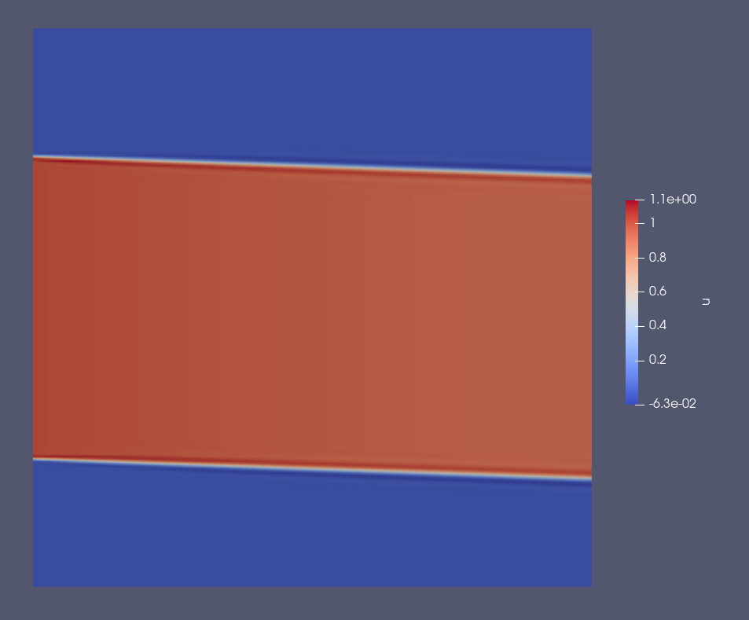

# The Diffusion solver

## Overview
The Diffusion solver was written by Chris Cantwell and Dave Moxey as a Nektar++ proxyapp for the NEPTUNE project.
The original source code and accompanying documentation can be found in the [nektar-diffusion](https://github.com/ExCALIBUR-NEPTUNE/nektar-diffusion) GitHub repository.
The `cwipi` example is based on another Nektar++ proxyapp, [nektar-cwipi](https://github.com/ExCALIBUR-NEPTUNE/nektar-cwipi).

## Equations
Both the `unsteady_aniso` and `cwipi` examples, solve an unsteady, anisotropic (heat) diffusion problem, that is

$$
\begin{align}
\frac{3}{2} n \frac{dT}{dt} = \nabla \cdot (\mathbf{\kappa}_s \nabla T) + Q
\end{align}
$$

where $T$ is the temperature, $n$ is the number density, $Q$ is a source term and $\mathbf{\kappa}_s$ is the anisotropic diffusion tensor.

$\mathbf{\kappa_s}$ can be decomposed into three orthogonal components; $\kappa_{\parallel}$, $\kappa_{\perp}$ and $\kappa_{\wedge}$:

$$
\begin{align}
\begin{bmatrix}
\kappa_{\perp} & -\kappa_{\wedge} & 0 \\
\kappa_{\wedge} & \kappa_{\perp} & 0 \\
0 & 0 & \kappa_{\parallel}\\
\end{bmatrix}
\end{align}
$$

For a plasma, $\kappa_{\parallel}$, $\kappa_{\perp}$ and $\kappa_{\perp}$ can be identified with Braginskii transport coefficients.

These coefficients are very different for electrons and ions, but considering the regime where B $\sim 1 T$ and $T_e~\sim~T_i$, we have $\kappa_{\parallel} \simeq \kappa_{\parallel}^e$ and $\kappa_{\perp}\simeq \kappa_{\perp}^i$, such that

$$
\begin{align}
\kappa_{\parallel} &= 19.2 \sqrt{2\pi^3} \frac{1}{\sqrt{m_e}} \frac{\epsilon^2_0}{e^4} \frac{(k_B T_e)^{5/2}}{Z^2 \lambda} \quad \\
\kappa_{\perp} &= \frac{1}{6\sqrt{\pi^3}} \frac{1}{m_i} \Big(\frac{n Z e}{B \epsilon_0}\Big)^2 \frac{(m_p A)^{3/2}\lambda}{\sqrt{k_B T_i}}
\end{align} 
$$

and for 2D problems: $\kappa_{\wedge}^e = \kappa_{\wedge}^i \simeq 0$.

## Model parameters

The table below shows a selection of the model parameters that can be modified in the XML configuration files. 

| Parameter     | Description                                                | Reference value         |
| ------------- | ---------------------------------------------------------- | ----------------------- |
| A = m_i/m_p   | Ion mass in proton masses                                  | 1                       |
| B             | Magnitude of the magnetic field                            | 1.0 T                   |
| n             | Number density of ions/electrons                           | $10^{18}$ ms $^{-1}$    |
| T             | (Electron) temperature                                     | 116050 K ($\sim$ 10 eV) |
| theta         | Angle between the magnetic field and the x-axis in degrees | 2.0                     |
| Z             | Ion charge state                                           | +1                      |
| lambda        | Coulomb logarithm                                          | 13                      |
| TimeStep      | Time step size                                             | 0.001                   |
| NumSteps      | Total number of time steps                                 | 5                       |
| IO_CheckSteps | Number of time steps between outputs                       | 1                       |

## Implementation

In both examples, the anisotropic diffusion problem is solved on a square mesh of 80x80 quads using a Continuous Galerkin discretisation.

The initial conditions have a top-hat like profile on the left edge of the domain:

$$
\begin{align}
T = 0.5 + 0.5~{\rm tanh}\left[a(y-77)\right]~{\rm tanh}\left[a(23-y)\right]
\end{align}
$$

The systems are solved using a Conjugate Gradient method and a simple Diagonal preconditioner.
Timestepping is performed with a first-order BDF method.

## Examples

### unsteady_aniso

Configuration files for the  `unsteady_aniso` example can be found in `examples/Diffusion/unsteady_aniso`.
The Gmsh file, `square.geo`, file is supplied in case users wish to modify the mesh, but the simulations only requires the xml files to run.
The easiest way to execute the example is with

    ./scripts/run_eg.sh Diffusion unsteady_aniso

which makes a copy of the example directory and executes the Diffusion solver in that location, using the command in `examples/Diffusion/unsteady_aniso/run_cmd_template.txt`.

### cwipi

    N.B. To run the `cwipi` example, NESO must be built with configuration option -DNESO_BUILD_CWIPI_EXAMPLES=ON and Nektar++ must have been built with option -DNEKTAR_USE_CWIPI=ON.
    The easiest way to enable all required options is to build the 'cwipi' variant of NESO via spack; i.e. spack install neso+cwipi

Configuration files for the  `cwipi` example can be found in `examples/Diffusion/cwipi`.

Like the previous example, an unsteady anisotropic diffusion problem is solved. 
Unlike the previous example, the process is split into two tasks, performed by separate executables and coupled via the [CWIPI framework](https://w3.onera.fr/cwipi/en).
The first executable computes the diffusion tensor based on the parameters set in its configuration file.
This tensor is then sent, via MPI, to the second executable, which uses it to evolve the system from the initial conditions and generate a solution.
Each executable can itself run using multiple MPI processes.
The MPI command used to run the coupled problem can be found in `examples/Diffusion/cwipi/run_cmd_template.txt`, but the easiest way to execute the example is: 

    ./scripts/run_eg.sh Diffusion cwipi

    N.B. The Diffusion solver occasionally hangs during the initialisation stage when running the `cwipi` example.  
    Rerunning the command above should work around the issue.

While this example is somewhat artificial, it serves to demonstrate how Nektar++, via CWIPI can be used to couple independent executables.
Other possible applications include running solvers in neighbouring domains and coupling them via boundary conditions with each domain representing a different material.
This could be used to model, for example, plasma turbulence in the tokamak edge and the resulting heat diffusion into the first wall. 
    

## Outputs
Outputs from the solver are written as Nektar++ checkpoint (`.chk`) files.
The easiest way to visualise them is to convert them to vtu format and inspect them in Paraview.

The final state of both examples should look like this:

*Temperature field (labelled 'u') in the final output of the unsteady_aniso example.*