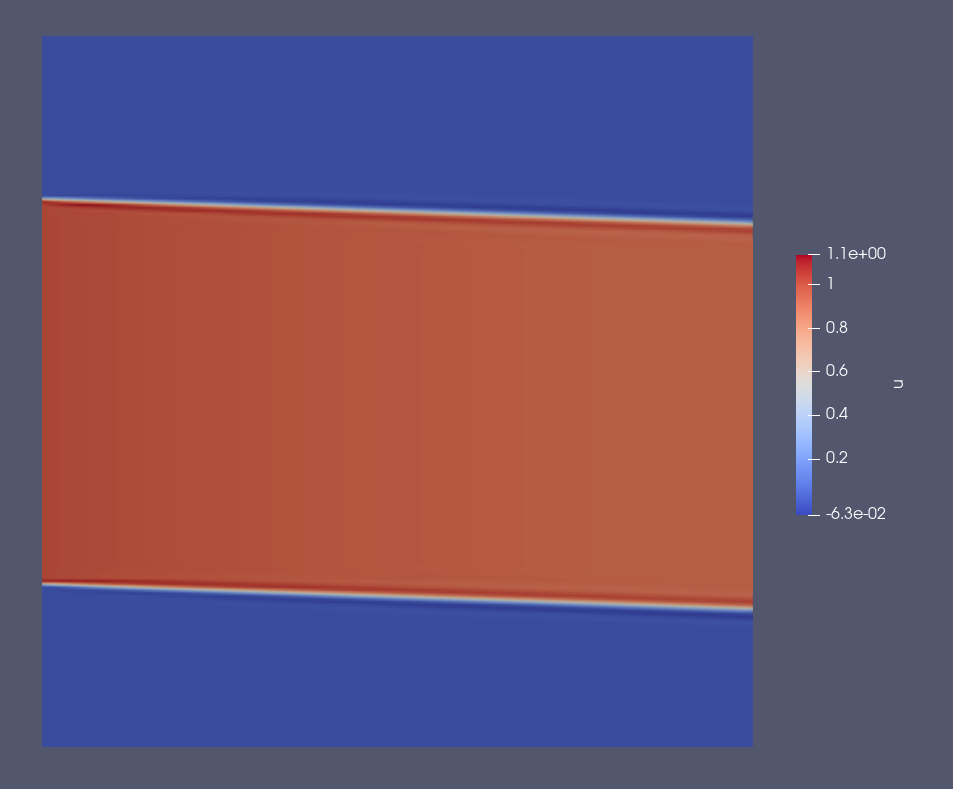

# The Diffusion solver

## Overview
The Diffusion solver was written by Chris Cantwell and Dave Moxey as a Nektar++ proxyapp for the NEPTUNE project.
The original source code and accompanying documentation can be found in the [nektar-diffusion](https://github.com/ExCALIBUR-NEPTUNE/nektar-diffusion) GitHub repository.
The `cwipi` example is based on another Nektar++ proxyapp, [nektar-cwipi](https://github.com/ExCALIBUR-NEPTUNE/nektar-cwipi).

## Equations
Both the `unsteady_aniso` and `cwipi` examples, solve an unsteady, anisotropic (heat) diffusion problem, that is

$$
\begin{align}
\frac{3}{2} n \frac{dT}{dt} = \nabla \cdot (\mathbf{\kappa}_s \nabla T) + Q
\end{align}
$$

where $T$ is the temperature, $n$ is the number density, $Q$ is a source term and $\mathbf{\kappa}_s$ is the anisotropic diffusion tensor.

$\mathbf{\kappa}_s$ can be decomposed into three orthogonal components; $\kappa_{\parallel}$, $\kappa_{\perp}$ and $\kappa_{\perp}$:

$$
\begin{align}
\begin{bmatrix}
\kappa_{\perp} & -\kappa_{\wedge} & 0 \\
\kappa_{\wedge} & \kappa_{\perp} & 0 \\
0 & 0 & \kappa_{\parallel}\\
\end{bmatrix}
\end{align}
$$

For a plasma, $\kappa_{\parallel}$, $\kappa_{\perp}$ and $\kappa_{\perp}$ can be identified with Braginskii transport coefficients.
These coefficients are very different for electrons and ions, but considering the regime where B$~\sim1 T$ and $T_e~\sim~T_i$, we have $\kappa_{\parallel}\simeq \kappa_{\parallel}^e$ and $\kappa_{\perp}\simeq \kappa_{\perp}^i$, such that

$$
\begin{align}
\kappa_{\parallel} &= 19.2 \sqrt{2\pi^3} \frac{1}{\sqrt{m_e}} \frac{\epsilon^2_0}{e^4} \frac{(k_B T_e)^{5/2}}{Z^2 \lambda} \quad \\
\kappa_{\perp} &= \frac{1}{6\sqrt{\pi^3}} \frac{1}{m_i} \Big(\frac{n Z e}{B \epsilon_0}\Big)^2 \frac{(m_p A)^{3/2}\lambda}{\sqrt{k_B T_i}}
\end{align} 
$$

In 2D, $\kappa_{\wedge}^e = \kappa_{\wedge}^i \simeq 0$.

## Model parameters

The table below shows a selection of the model parameters can be modified in the XML configuration files. 

| Parameter     | Description                                     | Reference value        |
| ------------- | ----------------------------------------------- | ---------------------- |
| A = m_i/m_p   | Ion mass in proton masses                       | 1                      |
| B             | Magnitude of the magnetic field                 | 1.0 T                  |
| n             | Number density of ions/electrons                | 10$^{18}$ ms$^{-1}$    |
| T             | (Electron) temperature                          | 116050 K ($\sim$10 eV) |
| theta         | Angle between the magnetic field and the x-axis | 2.0                    |
| Z             | Ion charge state                                | +1                     |
| lambda        | Coulomb logarithm                               | 13                     |
| TimeStep      | Time step size                                  | 0.001                  |
| NumSteps      | Total number of time steps                      | 5                      |
| IO_CheckSteps | Number of time steps between outputs            | 1                      |

## Implementation (unfinished)

The anisotropic diffusion problem is solved on a square mesh of quads.
Mention
- CG
- Timestepping: BDFImplicitOrder1
- Conj Grad iterative solve with diagonal preconditioner
- ICs: tanh profile on left-hand edge:
$$
0.5 + 0.5 * tanh(a*(y-77)) * tanh(a*(23-y))
$$

## Examples

### unsteady_aniso (unfinished)
<!-- Initial conditions
General setup -->
The example can be run with

    ./scripts/run_eg.sh Diffusion unsteady_aniso

### cwipi (unfinished)
<!-- Purpose -->
The example can be run with

    ./scripts/run_eg.sh Diffusion cwipi
    

## Outputs (fix image)
Outputs from the solver are written as Nektar++ checkpoint (`.chk`) files.
The easiest way to visualise them is to convert them to vtu format and inspect them in Paraview.

The final state of both examples should look like this:

