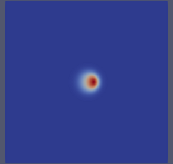
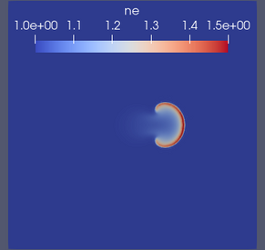

# The DriftPlane solver

## Overview
The `DriftPlane` solver is based on a Nektar++ proxyapp written by Dave Moxey for the NEPTUNE project.
The original source code and accompanying documentation can be found in the [nektar-driftplane](https://github.com/ExCALIBUR-NEPTUNE/nektar-driftplane) GitHub repository.

## Examples

### blob2D

The blob2D example was inspired by the BOUT++/[Hermes-3 demo of the same name.](https://hermes3.readthedocs.io/en/latest/examples.html#blob2d) 
It tracks the formation of a plasma filament from an overdense "blob", subject to a diamagnetic drift force.

The model considers a single, isothermal fluid evolving in a square domain where the x-axis represents the radial coordinate in a tokamak and the $(x,y)$ plane is a 2D slice at a particular toroidal angle. Moving to the right through the domain corresponds to moving further towards the outboard side of the tokamak. 

#### Equations

The equations are: 

$$
\begin{align}
\frac{\partial n}{\partial t} &= \frac{1}{B} \left ( \frac{\partial \phi}{\partial x} \frac{\partial n_e}{\partial y} + \frac{\partial 
\phi}{\partial y} \frac{\partial n_e}{\partial x} \right ) + \frac{n_e \phi}{L_{\parallel}}\\
\frac{\partial \omega}{\partial t}  &= \frac{1}{B} \left ( \frac{\partial \phi}{\partial x} \frac{\partial \omega}{\partial y} + \frac{\partial 
\phi}{\partial y} \frac{\partial \omega}{\partial x} \right ) + \epsilon  \frac{\partial n_e}{\partial y} + \frac{n_e 
\phi}{L_{\parallel}}\\
\nabla^2 \phi &= B^2 \omega,
\end{align}
$$

where $n$ is the electron density, $\omega$ is the electron vorticity and $\phi$ is the electrostatic potential.
$\epsilon\frac{\partial n_e}{\partial y}$ is the diamagnetic drift term.
$\frac{n_e \phi}{L_{\parallel}}$ is a "connection term" that stands in for the divergence of the sheath current, $\nabla \cdot {\bf j}_{sh}$, in order to capture the behaviour of the plasma at the ends of the field lines, perpendicular to the simulation domain (the *drift-plane*).
$L_{\parallel}$ is the connection length.

A more detailed discussion of the model can be found in section 2.1 of the [M6c.3 project NEPTUNE report](https://excalibur-neptune.github.io/Documents/CD-EXCALIBUR-FMS0074-M6c.3_ExcaliburFusionModellingSystemComplementaryActionsCodeIntegrationAcceptanceOpera.html).

#### Model parameters

The table below shows a selection of the configuration options that can be modified under the `PARAMETERS` node of the `blob2d` XML configuration file. 

| Parameter     | Label in config file | Description                                   | Default Value |
| ------------- | -------------------- | --------------------------------------------- | ------------- |
| $B$           | B                    | (Poloidal) magnetic field strength in T.      | 0.35          |
| $T_{e0}$      | T_e                  | Electron temperature in eV.                   | 5             |
| $L_\parallel$ | Lpar                 | Connection length in m.                       | 10.0          |
| $R_{xy}$      | Rxy                  | Tokamak major radius in m.                    | 1.5           |
|               | init_blob_norm       | (Density) amplitude of initial Gaussian blob. | 0.5           |
|               | init_blob_width      | Width of initial Gaussian blob in m.          | 0.05          |

Note that the factor $\epsilon$ in the vorticity equation is calculated by the code internally as $\epsilon=\frac{e T_e}{R_{xy}^2}$.

#### Implementation

In the DriftPlane solver, the blob2D system is discretised using a Discontinous Galerkin formulation for the density and vorticity and Continuous Galerkin for the potential.
The potential is not evolved directly, but is calculated at each timestep from the the vorticity using Nektar++'s Helmholtz solver.
The mesh is a unit square of 64x64 quadrilateral elements and 5th order basis functions are used for all fields.
The initial density condition is a Gaussian blob at the centre of the domain, while the vorticity (and therefore the potential) is set to zero everywhere.
Nektar++'s default solver options are used, that is, a Conjugate Gradient method with static condensation and a simple Diagonal/Jacobi preconditioner.
Timestepping is performed with a 4th order Runge-Kutta (explicit) method.

#### Output
Field outputs from the solver are written as Nektar++ checkpoint (`.chk`) files.
The easiest way to visualise them is to convert them to vtu format and inspect them in Paraview.
Evolution of the electron density should resememble the images shown below.

*Electron density at t=0.4 (left), t=1.2 (centre) and t=2 (right) in the blob2D example.*