# The DriftReduced solver

## Overview
The `DriftReduced` solver provides a number of simple models for 2D and 3D plasma turbulence.
All of these models either directly or indirectly incorporate an $E{\times}B$ plasma drift velocity, calculated via the gradient of the electrostatic potential, which in turn is calculated from a vorticity field. The machinery to compute the drift velocity, and then advect the plasma accordingly, is therefore implemented in a common class from which all of the `DriftReduced` model equation systems are derived. 

The following subsections describe the examples that are currently available.

    Note that many of the DriftReduced examples are expected to exhibit chaotic behaviour, with small numerical differences between compilers and platforms being magnified over the course of a simulation.
    While the statistical properties of fluid fields are expected to be robust, outputs may differ in detail from those shown.

## Examples

### 2DHW

The `2DHW` equation system and example are adapted from a Nektar++ proxyapp written by Dave Moxey and Jacques Xing for the NEPTUNE project.
The original source code and accompanying documentation can be found in the [nektar-driftwave](https://github.com/ExCALIBUR-NEPTUNE/nektar-driftwave) GitHub repository.

The example can be run with

    ./scripts/run_eg.sh DriftReduced 2DHW

#### Equations

Solves the 2D Hasegawa-Wakatani (HW) equations. That is:

$$
\begin{align}
    \frac{\partial n}{\partial t} + [\phi, n]  & = \alpha (\phi - n) - \kappa \frac{\partial\phi}{\partial y} &~~~(1)\\
    \frac{\partial{\omega}}{\partial t} + [\phi, \omega] & = \alpha (\phi - n) &~~~(2)
\end{align}
$$

where $\omega$ is vorticity and $\phi$ is the electrostatic potential.
The potential can be obtained from the vorticity by solving the Possion equation $\nabla^2\omega = \phi$.
$n$ is plasma number density *relative to a fixed background profile*, so need not be positive.
The background profile is assumed to be exponential with a scale length related to $\kappa$.
The strength of the coupling between the density and the potential is mediated by $\alpha$, the *adiabacity parameter*.

$[a,b]$ is the Poisson bracket operator, defined as

$$
\begin{equation}
    [a,b] = \frac{\partial a}{\partial x} \frac{\partial b}{\partial y} - \frac{\partial a}{\partial y} \frac{\partial 
b}{\partial x}.
\end{equation}
$$

Note that equations (1) and (2) represent the "unmodified" form of the HW equations, which don't include so-called *zonal flows* (see e.g. [this webpage](https://ammar-hakim.org/sj/je/je17/je17-hasegawa-wakatani.html#the-modified-hasegawa-wakatani-system) for further explanation.)

#### HW Model parameters

The table below shows a selection of the configuration options that can be modified under the `PARAMETERS` node of the XML configuration file. 

| Parameter | Label in config file | Description                                                                               | Default value |
| --------- | -------------------- | ----------------------------------------------------------------------------------------- | ------------- |
| $B$       | Bxy                  | Magnetic field strength (normalised units)                                                | 1.0           |
| $\alpha$  | HW_alpha             | Adiabacity parameter: controls coupling between $n$ and $\phi$                            | 2.0           |
| $\kappa$  | HW_kappa             | Turbulent drive parameter: assumed scale length of background exponential density profile | 1.0           |
| -         | s                    | Initial blob size: Scale length of the Gaussian density ICs (normalised units)            | 2.0           |

*Table 1: Configurable model parameters for the 2DHW example*

#### Implementation

The `2DHW` system is discretised using a Discontinous Galerkin formulation for the density and vorticity and Continuous Galerkin for the potential.
The potential is not evolved directly, but is calculated at each timestep from the the vorticity using Nektar++'s Helmholtz solver.
The use of DG for the time-evolved fields increases stability sufficiently that it isn't necessary to include the hyperdiffusivity terms ($\mu \nabla^4 n$, $\mu \nabla^4 \omega$) that are often added to other HW implementations.
The mesh is a 20x20 square of 64x64 quadrilateral elements and 3rd order basis functions are used for all fields.
Boundary conditions are periodic in both the $x$ and $y$ dimensions for all fields.

The initial conditions for density and vorticity are Gaussians with widths $s$ (see [Table 1](#hw-model-parameters)):

$$
\begin{align}
n_i &= e^\left[-(x^2+y^2)/s^2\right] \\
\omega_i &= 4 e^\left[-(x^2+y^2)/s^2\right] \frac{x^2+y^2-s^2}{s^4}
\end{align}
$$

Nektar++'s default solver options are used, that is, a Conjugate Gradient method with static condensation and a simple Diagonal/Jacobi preconditioner.
Timestepping is performed with a 4th order Runge-Kutta (explicit) method.

#### Outputs
Processing the final checkpoint of the simulation and rendering it in Paraview should produce output resembling the images below:

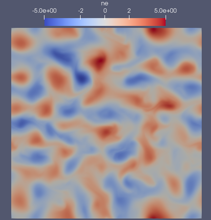
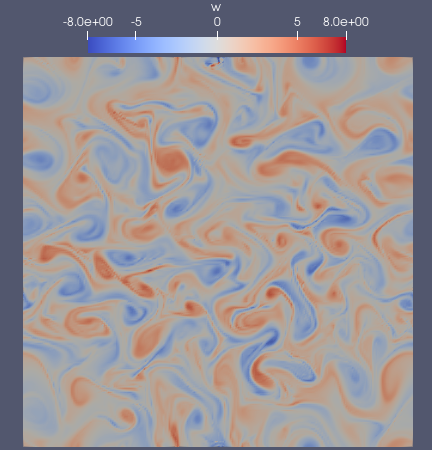

*Density (left) and vorticity (right) in the final output of the 2DHW example (t=50).*
<!-- ------------------------------------------------------------------------------------------ -->
---

### 2Din3DHW_fluid_only

Solves the 2D HW equations, (1) and (2), in a 3D domain.
The magnetic field is assumed to be constant and parallel to the z-axis, so that the Poisson solve for the potential becomes

$$
\begin{align}
\omega &= \nabla_{\perp}^2\phi \\
       &=\frac{\partial{^2}\phi}{\partial{x^2}}+\frac{\partial{^2}\phi}{\partial{y^2}} &~~~(3)
\end{align}
$$

where the $_\perp$ subscript denotes the restriction of the Laplacian to the two-dimensional subspace transverse to the field lines.

More details of the implementation can be found in section 2.3.1 of [NEPTUNE report M4c.3](https://excalibur-neptune.github.io/Documents/CD-EXCALIBUR-FMS0079-M4c.3_ExcaliburFusionModellingSystemDevelopment3DIntegratedParticleContinuumModel.html).

The example can be run with

    ./scripts/run_eg.sh DriftReduced 2Din3DHW_fluid_only

#### Implementation

The list of configurable model parameters is the same as for the `2DHW` example; see [Table 1](#hw-model-parameters).

The domain is a cuboid with dimensions (arbitrary length units) 5x5x10.
The mesh, generated via Gmsh and Nekmesh, has 8x8x16 hexahedral elements and 6th order basis functions are used for all fields.
Boundary conditions are periodic in all three dimensions.
Nektar++'s default solver options are used, that is, a Conjugate Gradient method with static condensation and a simple Diagonal/Jacobi preconditioner.
Timestepping is performed with a 4th order Runge-Kutta (explicit) method.
Although all of the modelled dynamics are in the (x,y) subspace, variation is introduced in the z dimension by modulating the initial conditions used in the `2DHW` example with a sinusoidal function in the $z$ direction:

$$
\begin{align}
n_i &= 6 e^\left[\frac{-(x^2+y^2)}{s^2}\right] \sin\left(\frac{4\pi z}{z_{\rm max}}\right) &~~~(4)\\
\omega_i &= 4 e^\left[\frac{-(x^2+y^2)}{s^2}\right] \frac{x^2+y^2-s^2}{s^4} \sin\left(\frac{4\pi z}{z_{\rm max}}\right) &~~~(5)
\end{align}
$$

#### Outputs

Field outputs from the solver are written as Nektar++ checkpoint (`.chk`) files.
The easiest way to visualise them is to convert them to vtu format and inspect them in Paraview.
Evolution of the electron density should resememble the images shown below.

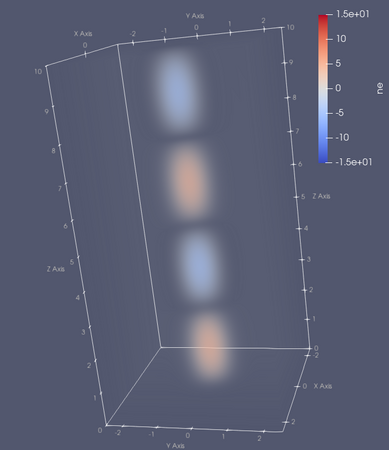
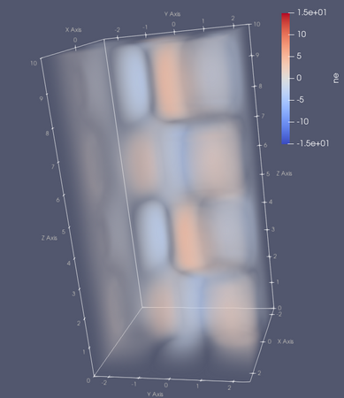
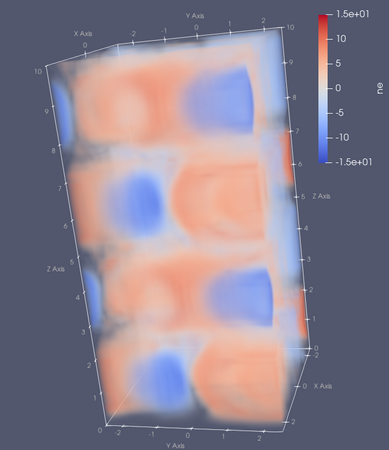
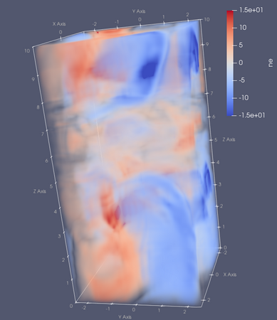

*Electron density at t=0 (top-left), t=12.5 (top-right), t=25 (bottom-left) and t=40 (bottom-right) in the `2Din3DHW_fluid_only` example*

<!-- ------------------------------------------------------------------------------------------ -->
---

### 2Din3DHW

The fluid model and equations considered in the `2Din3DHW` example are the same as those described above.
Equations (1) and (2) are solved in a 3D domain, but additional source terms from (Hydrogenic) ionisation are added by including a system of kinetic neutrals that are coupled to the fluid solver.

The example can be run with

    ./scripts/run_eg.sh DriftReduced 2Din3DHW

#### Model parameters

In addition to those parameters listed in [Table 1](#hw-model-parameters), a number of particle system properties can be configured.

| Parameter      | Label in config file      | Description                                                                                      | Default value |
| -------------- | ------------------------- | ------------------------------------------------------------------------------------------------ | ------------- |
| $N_{\rm part}$ | num_particles_total       | Total number of (neutral) particles to generate.                                                 | 100000        |
| $n_{\rm phys}$ | particle_number_density   | Physical number density of neutrals in SI units                                                  | 1e16          |
| $v_{\rm th}$   | particle_thermal_velocity | Width of the Gaussian from which random particle thermal velocities are drawn. Normalised units. | 1.0           |
| $v_{\rm d}$    | particle_drift_velocity   | Bulk drift velocity given to all particles. Normalised units.                                    | 2.0           |
| $\sigma_p$     | particle_source_width     | Width of the Gaussian from which random particle positions are drawn. Normalised units.          | 0.2           |
| $T$            | Te_eV                     | Assumed electron temperature in eV.                                                              | 10.0          |

*Table 2: Configurable model parameters for the 2Din3DHW example*

#### Implementation

The domain, mesh, fluid solver properties and boundary conditions in this example are the same as those described in the `2Din3DHW_fluid_only` example.
The initial conditions are set to zero throughout the domain for both $n$ and $\omega$, such that all non-trivial evolution of the fluid fields is triggered by particle sources.
Neutral particles, like the fluid fields, are subject to periodic boundary conditions in all three dimensions.

$N_{\rm part}$ computational particles are generated at the beginning of the simulation and assigned initial weights (equal to the number of
physical neutrals that they represent) such that the overall number density in the domain matches the requested $n_{\rm phys}$ value.

Initial particle positions are chosen by drawing values at random from a 3D Gaussian distribution centred at the origin and with a width $\sigma_p$.
Initial velocities are assigned a bulk drift velocity, $v_{\rm d}$, which is added to a random thermal velocity, drawn from a second Gaussian of width $v_{\rm th}$.

At every particle timestep, the fluid density is evaluated at each computational particle position and used, in combination with the assumed temperature, to compute the rate at which neutral Hydrogen atoms are expected to be ionised ($r_{\rm ionise}$) according to equation 5 in [Lotz, 1968](https://doi.org/10.1007/BF01392963).

The computational particle weight is then reduced by an amount

$$\delta_w = r_{\rm ionise} \times w_i \times n \times {\rm dt}$$

where $w_i$ is the current weight associated with each particle, $n$ is the (fluid) number density evaluated at its position and dt is the length of the time step.

More details of the implementation can be found in section 2.3.1 of [NEPTUNE report M4c.3](https://excalibur-neptune.github.io/Documents/CD-EXCALIBUR-FMS0079-M4c.3_ExcaliburFusionModellingSystemDevelopment3DIntegratedParticleContinuumModel.html).

#### Outputs

Fluid field outputs from the solver are written as Nektar++ checkpoint (`.chk`) files and all particle data is written to `DriftReduced_particle_trajectory.h5part`.
Both can be visualised together by converting the checkpoint files to vtu format and then loading both the .vtu files and the .h5part file in Paraview.
The early evolution of the plasma density and the neutral particle weights should resememble the images shown below.

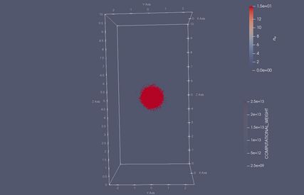
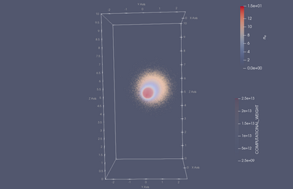

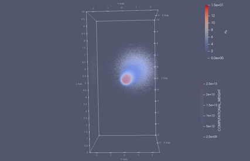
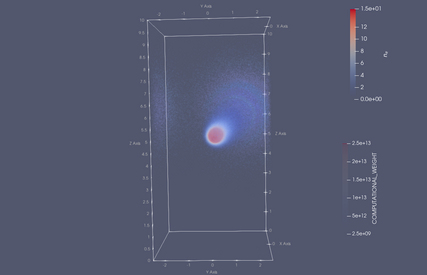

*Evolution of the particle distribution (points) and electron density (coloured contours) during the early part of the `2Din3DHW` example.
Particles are coloured according to their computational weight, corresponding to the number of physical neutrals that they represent.
Output times are t=0 (top-left), t=0.225 (top-right), t=0.45 (bottom-left) and t=0.675 (bottom-right).*

The particles start in a Gaussian blob with a bulk drift, before spreading out due to variations in their thermal velocities.
As the simulation progresses, neutral particles ionise, reducing the weight associated with each computational particle (blue points) and adding to the plasma density (redder contours). 

<!-- ------------------------------------------------------------------------------------------ -->
---

### 2DRogersRicci

Model based on the **2D** (finite difference) implementation described in "*Low-frequency turbulence in a linear magnetized plasma*", B.N. Rogers and P. Ricci, PRL **104**, 225002, 2010 ([link](https://journals.aps.org/prl/abstract/10.1103/PhysRevLett.104.225002)); see their equations (7)-(9).

The example can be run with

    ./scripts/run_eg.sh DriftReduced 2DRogersRicci

#### Equations

In SI units, the equations are:

$$
\begin{aligned}
\frac{d n}{dt} &= -\sigma\frac{n c_s}{R}\exp(\Lambda - e\phi/T_e) + S_n &~~~(6)\\
\frac{d T_e}{dt} &= -\sigma\frac{2}{3}\frac{T_e c_s}{R}\left[1.71\exp(\Lambda - e\phi/T_e)-0.71\right] + S_T &~~~(7)\\
\frac{d \nabla^2\phi}{dt} &= \sigma \frac{c_s m_i \Omega_{ci}^2}{eR}\left[1-\exp(\Lambda - e\phi/T_e)\right] &~~~(8)\\
\end{aligned}
$$

where

$$
\begin{aligned}
\sigma &= \frac{1.5 R}{L_z} \\
\frac{df}{dt} &= \frac{\partial f}{\partial t} - \frac{1}{B}\left[\phi,f\right] \\
\end{aligned}
$$

and the source terms have the form

$$
\begin{aligned}
S_n &= S_{0n}\frac{1-{\rm tanh[(r-r_s)/L_s]}}{2} \\
S_T &= S_{0T}\frac{1-{\rm tanh[(r-r_s)/L_s]}}{2} \\
\end{aligned}
$$

where $r = \sqrt{x^2 + y^2}$

#### Model parameters

| Parameter     | Label in config file | Description                          | Default Value |
| ------------- | -------------------- | ------------------------------------ | ------------- |
| $T_{e0}$      | T_0                  | Temperature.                         | 6 eV          |
| $m_i$         | m_i                  | Ion mass.                            | 6.67e-27 kg   |
| $\Lambda$     | coulomb_log          | Couloumb Logarithm.                  | 3             |
| $\Omega_{ci}$ | Omega_ci             | Ion cyclotron frequenxy in Hz.       | $9.6e5$       |
| R             | R                    | Approx. radius of the plasma column. | 0.5 m         |

*Table 3: Configurable model parameters for the 2DRogersRicci example*

<!-- Add these back in once the normalisation factors are calculated correctl; hard-coded for now -->
<!-- | $n_0$     |                      | Density normalisation factor in $m^{-3}$. | $2e18$        | -->
<!-- | $L_z$         | XXX                  | Assumed length of the device (perpendicular to the 2D domain) in m. | 18            | -->

Derived values
| Parameter   | Description                                | Calculated as            | Value                               |
| ----------- | ------------------------------------------ | ------------------------ | ----------------------------------- |
| B           | Magnetic field strength.                   | $\Omega_{ci} m_i q_E$    | 40 mT                               |
| $c_{s0}$    | Sound speed.                               | $\sqrt{T_{e0}/m_i}$      | 1.2e4 ms-1               |
| $\rho_{s0}$ | Larmor radius.                             | $c_{s0}/\Omega{ci}$      | 1.2e-2 m                            |
| $S_{0n}$    | Density source scaling factor.             | 0.03 $n_0 c_{s0}/R$      | 4.8e22 m-3s-1 |
| $S_{0T}$    | Temperature source scaling factor.         | 0.03 $T_{e0} c_{s0} / R$ | 4318.4 Ks-1              |
| $\sigma$    |                                            | $1.5 R/L_z$              | 1/24                                |
| $L_s$       | Scale length of source terms.              | $0.5\rho_{s0}$           | 6e-3 m                              |
| $r_s$       | Approx. radius of the LAPD plasma chamber. | $20\rho_{s0}$            | 0.24 m                              |

#### Normalisation

Normalisations follow those in Rogers & Ricci, that is:

|                       | Normalised to   |
| --------------------- | --------------- |
| Charge                | $e$             |
| Electric potential    | $e/T_{e0}$      |
| Energy                | $T_{e0}$        |
| Number densities      | $n_0$           |
| Perpendicular lengths | $100 \rho_{s0}$ |
| Parallel lengths      | $R$             |
| Time                  | $R/c_{S0}$      |

The normalised forms of the equations are:

$$
\begin{align}
\frac{\partial n}{\partial t} &= 40\left[\phi,n\right] -\frac{1}{24}\exp(3 - \phi/T_e)n + S_n  &~~~(9) \\
\frac{\partial T_e}{\partial t} &= 40\left[\phi,T_e\right] -\frac{1}{36}\left[1.71\exp(3 - \phi/T_e)-0.71\right]T_e + S_T  &~~~(10) \\
\frac{\partial  \nabla^2\phi}{\partial t} &= 40\left[\phi,\nabla^2\phi\right] + \frac{1}{24}\left[1-\exp(3 - \phi/T_e)\right] &~~~(11)\\
\nabla^2\phi &= \omega &~~~(12) \\
\end{align}
$$

with 

$$
\begin{equation}
S_n = S_T = 0.03\left\\{1-\tanh[(\rho_{s0}r-r_s)/L_s]\right\\}
\end{equation}
$$

where $\rho_{s0}$, $r_s$ and $Ls$ have the (SI) values listed in the tables above.
<!-- This system can be be obtained by applying the normalisation factors, then simplifying; see [here](./details/rogers-ricci-2d-normalised.md) for details. Note that the prime notation used in the derivations is dropped in the equations above for readability. -->

#### Implementation

The default initial conditions are

| Field    | Default ICs (uniform)                                  |
| -------- | ------------------------------------------------------ |
| n        | $2\times10^{14}$ ${\rm m}^{-3}$ ($10^{-4}$ normalised) |
| T        | $6\times10^{-4}$ eV ($10^{-4}$ normalised)             |
| $\omega$ | 0                                                      |

All fields have Dirichlet boundary conditions with the following values:

| Field    | Dirichlet BC value |
| -------- | ------------------ |
| n        | $10^{-4}$          |
| T        | $10^{-4}$          |
| $\omega$ | 0                  |
| $\phi$   | $\phi_{\rm bdy}$   |

$\phi_{\rm bdy}$ is set to 0.03 by default. This value ensures that $\phi$ remains relatively flat outside the central source region and avoids boundary layers forming in $\omega$ and $\phi$. 

The mesh is a square with the origin at the centre and size $\sqrt{T_{e0}/m_i}/\Omega{ci} = 100\rho_{s0} = 1.2$ m.
By default, there are 64x64 quadrilateral (square) elements, giving sizes of 1.875 cm = 25/16 $\rho_{s0}$
The default simulation time is $\sim 12$ in normalised units (= $500~{\rm{\mu}s}$).
<!-- Element order -->
<!-- Anything else mentioned in DriftPlane/Implementation? -->

#### Outputs

Processing the final checkpoint of the simulation and rendering it in Paraview should produce output resembling the image below:

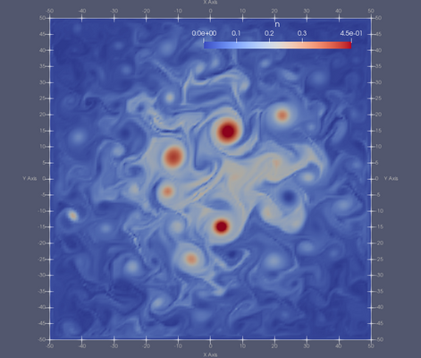

*Density in normalised units, run with the implicit DG implementation on a 64x64 quad mesh for 12 normalised time units (5 ms).*

<!-- ------------------------------------------------------------------------------------------ -->
---

### 3DHW

Solves the 3D HW equations in a slab geometry with a fixed, axis-aligned magnetic field.

<!-- More details of the implementation can be found in section 3 of [NEPTUNE report M6c.5](https://excalibur-neptune.github.io/Documents/TO_BE_UPLOADED). -->

The example can be run with

    ./scripts/run_eg.sh DriftReduced 3DHW

#### Equations

The 3D Hasegawa-Wakatani equations are similar to the 2D equations, but with the constant adiabacity parameter replaced by a second order spatial derivative in the parallel direction, that is:

$$
\begin{align}
    \frac{\partial n}{\partial t} =      & -[\phi,n] - \alpha\nabla\cdot\left[\mathbf{b}(\partial_\parallel\phi-\partial_\parallel n)\right] -\kappa\frac{\partial \phi}{\partial y}&~~~(13)\\
    \frac{\partial \omega}{\partial t} = & -[\phi,\omega] - \alpha\nabla\cdot\left[\mathbf{b}(\partial_\parallel\phi-\partial_\parallel n)\right]&~~~(14)\\
\end{align}
$$

Note that, as with the 2D HW equations, (1) and (2), $n$ represents a fluctuation on a fixed background.
Computing $\phi$ at each timestep takes place in exactly the same way as described in the [2Din3DHW_fluid_only example](#2din3dhw_fluid_only).

#### Model parameters

The values of $\alpha$ and $\kappa$ may be set in the same way as the other HW examples (see labels in [Table 1](#hw-model-parameters)).
Note that $\alpha$ has a slightly different meaning in the 2D and 3D version of the equations.
The following additional parameters can be set in 3D as an alternative to specifying $\alpha$ and $\kappa$ directly:

| Parameter   | Label in config file | Description                           | Default value                        |
| ----------- | -------------------- | ------------------------------------- | ------------------------------------ |
| $m_i$       | mi                   | Ion mass in kg.                       | 2 $\times$ 1.67 $\times 10^{-27}$ kg |
| $n_0$       | n0                   | Background density in ${\rm m}^{-3}$. | None                                 |
| $T_0$       | T0                   | Background temperature in eV.         | None                                 |
| $Z$         | Z                    | Ion charge state.                     | None                                 |
| $\lambda_n$ | lambda_q             | Scrape-off layer density width in m.  | None                                 |

If all of the parameters, $m_i$, $n_0$, $T_0$ and $Z$ are provided, they will be used to calculate a value for $\alpha$ via:

$$
\begin{align}
\log\Lambda_{e,i} &= 31 - 0.5 \ln{n_{0}} + \ln{T_{0}} \\
\eta &=5.2\times10^{-5} Z \log\Lambda_{e,i} / (T_0^{3/2}) \\
\omega_{ci} &= \frac{e B}{m_i} \\
\alpha &= \frac{T_0}{n_{0}\eta e \omega_{ci}}
\end{align}
$$

where $\eta$ is the Spitzer electron resistivity and $\omega_{ci}$ is the ion cyclotron frequency.

If all of the parameters, $m_i$, $n_0$, $T_0$ and $\lambda_n$ are provided, they will be used to calculate a value for $\kappa$ via:

$$
\begin{align}
    \rho_{s0} &= \sqrt{\frac{m_i T_0}{e B}} \\
    \kappa &= \rho_{s0} / \lambda_{n}
\end{align}
$$

where $\rho_{s0}$ is the the ion gyro-radius.

#### Implementation

Like the other Hasegawa-Wakatani examples, the `3DHW` system is discretised using a Discontinous Galerkin formulation for the density and vorticity and Continuous Galerkin for the potential, and the potential is calculated via equation 3 using Nektar++'s Helmholtz solver.

The domain is a cuboid shape which is twice as long in the field-parallel direction as in normal and bi-normal directions. (dimensions 5x5x10).
Fluid elements are unit cubes and 6th order basis functions are used for all fields.
The initial conditions for $\phi$ and $n$ are the same as those used in the `2Din3DHW_fluid_only` (see equations 4 and 5)
Boundary conditions for all fields are periodic in all three dimensions.

Nektar++'s default solver options are used, that is, a Conjugate Gradient method with static condensation and a simple Diagonal/Jacobi preconditioner.
Timestepping is performed with a 4th order Runge-Kutta (explicit) method.

#### Outputs

Outputs from the example are written as Nektar++ checkpoint (`.chk`) files.
The easiest way to visualise the fields is to convert the files to vtu format and inspect them in Paraview.
Evolution of the electron density should resememble the images shown below.

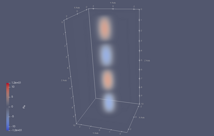
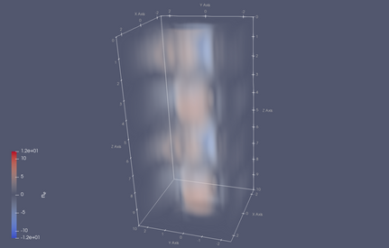

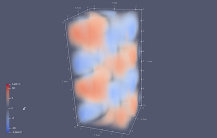
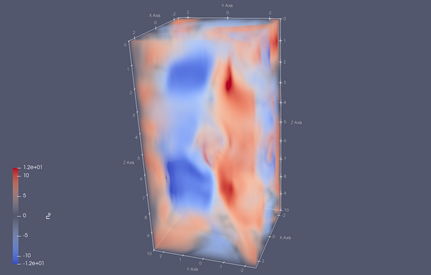

*Evolution of the electron density in the `3DHW` example.
Output times are t=0 (top-left), t=10 (top-right), t=25 (bottom-left) and t=40 (bottom-right).*

<!-- ------------------------------------------------------------------------------------------ -->

## Diagnostics
For the Hasegawa-Wakatani examples (`2DHW`,` 2Din3DHW_fluid_only`, `2Din3DHW`, `3DHW`), the solver can be made to output the total fluid energy ($E$) and enstrophy ($W$), which are defined as:  

$$
\begin{align}
E&=\frac{1}{2}\int (n^2 + |\nabla\phi|^2)~\mathbf{dx}\\ 
W&=\frac{1}{2}\int (n-\omega)^2~\mathbf{dx}
\end{align}
$$

In the `2DHW` and `2Din3DHW_fluid_only` examples, the expected growth rates of $E$ and $W$ can be calculated analytically according to:

$$
\begin{align}
\frac{dE}{dt} &= \Gamma_n-\Gamma_\alpha &~~(15)\\
\frac{dW}{dt} &= \Gamma_n &~~(16)
\end{align}
$$

where

$$
\begin{align}
\Gamma_\alpha &= \alpha \int (n - \phi)^2~\mathbf{dx}\\
\Gamma_n &= -\kappa \int n \frac{\partial{\phi}}{\partial y}~\mathbf{dx}
\end{align}
$$

To change the frequency of this output, modify the value of `growth_rates_recording_step` inside the `<PARAMETERS>` node in the example's configuration file.
When that parameter is set, the values of $E$ and $W$ are written to `<run_directory>/growth_rates.h5` at each simulation step $^*$.  Expected values of $\frac{dE}{dt}$ and $\frac{dW}{dt}$, calculated with equations (15) and (16) are also written to file, but note that these are only meaningful when particle coupling is disabled.

$^*$ Note that the file will appear empty until the file handle is closed at the end of simulation.