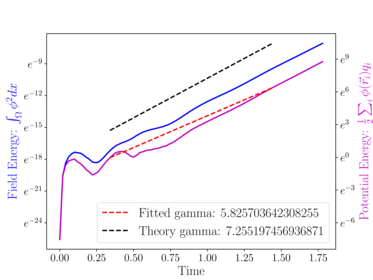
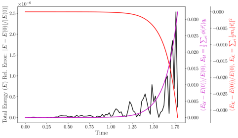

# The Electrostatic2D3V solver

## Overview

The theory behind the Electrostatic2D3V solver and the `two_stream` example can be found in NEPTUNE report [M4c.1: 1-D and 2-D Particle Models](https://excalibur-neptune.github.io/Documents/CD-EXCALIBUR-FMS0070-1.00-M4c.1_ExcaliburFusionModellingSystem.html); see section 2.2 in particular.

## Examples

### two_stream

The example can be run with

    ./scripts/run_eg.sh Electrostatic2D3V two_stream

#### Outputs and postprocessing

Unlike other NESO examples, the Electrostatic2D3V solver doesn't generate Nektar++ checkpoint files.
Instead it outputs `Electrostatic2D3V_field_trajectory.h5` which contains particle data in [H5Part](https://ieeexplore.ieee.org/document/1591740) format, a derivative of HDF5.
This file can be visualised in (e.g.) Paraview or postprocessed using the supplied Python script, which plots the energy evolution and compares it to theory.
To run the script, install all required Python packages, then pass it the Nektar++ configuration file and the .h5 file as arguments:
```
pip install -r requirements.txt
python3 plot_two_stream_energy.py two_stream.xml Electrostatic2D3V_field_trajectory.h5
```

The plots are written to `field_energy.pdf` and `all_energy.pdf` and are reproduced below for convenience:


