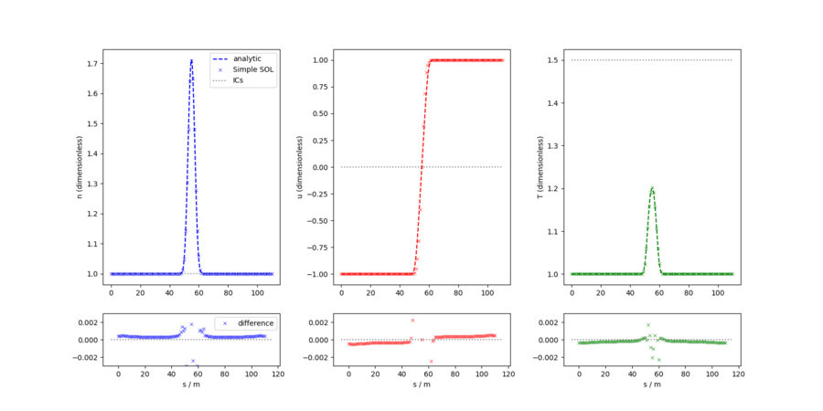
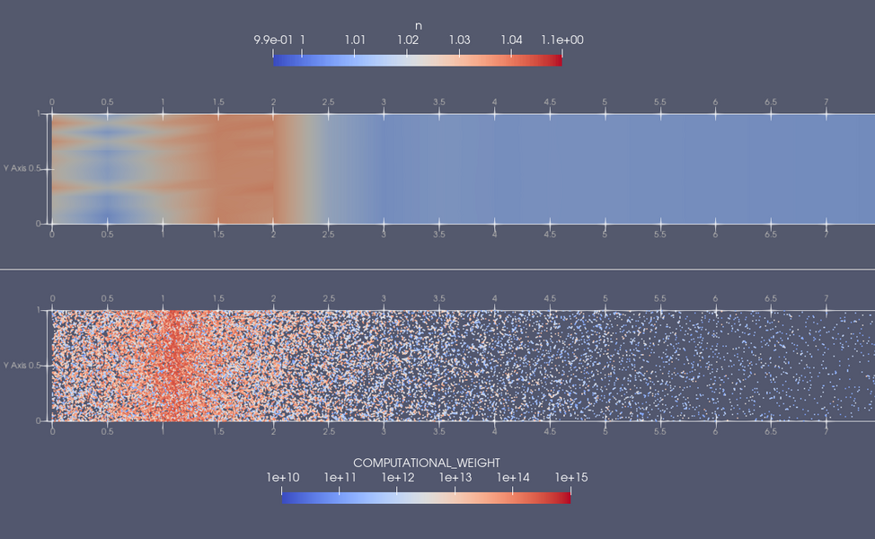

# The SimpleSOL solver

The `SimpleSOL` solver models transport along a field line in the scrape-off layer (SOL) of a tokamak.
The domain is a symmetric flux tube, wherein plasma is assumed to enter from the perpendicular direction due to cross-field transport, then move along the field line towards a divertor (at both ends).
At the divertor, it is assumed that plasma is extracted at a prescribed, constant velocity.
The model describes the evolution of plasma density, velocity and temperature.
Profiles of the three fields when the system has reached a steady state are determined purely by the boundary conditions and the shape of the source terms.
The plasma is assumed to have an ideal gas equation of state.
The solver can also be extended to evolve a system of neutral particles, which ionise and contribute additional source terms to the fluid equations.

## Examples

<!-- ------------------------------------------------------------------------------------------ -->
### 1D

The example can be run with

    ./scripts/run_eg.sh SimpleSOL 1D

#### Equations

The equations associated with the 1D `SimpleSOL` problem are:

$$
\begin{aligned}
    \frac{\partial n}{\partial t} &= -\frac{\partial(nu)}{\partial s} + S^n &~~~(1)\\
    \frac{\partial }{\partial t} (nu) &= -\frac{\partial(nu^2)}{\partial s} + \frac{\partial(nT)}{\partial s} + S^u &~~~(2)\\
    \frac{\partial }{\partial t} \left( (g-2)nT + n u^2 \right) &= - \frac{\partial(gnuT + nu^3)}{\partial s} + S_T &~~~(3)
\end{aligned}
$$

where $s$ is the spatial coordinate $n$ is the plasma density, $u$ the plasma velocity, and $T$ the plasma temperature.
$S^n$, $S^u$ and $S_T$ are source terms in density, momentum and temperature respectively.
$g$ is related to the ratio of specific heats, $\gamma$, by $g=\frac{2\gamma}{\gamma-1}$
Using the ideal gas law, it can be shown that this system is almost exactly
equivalent to the compressible Euler equations.
Reframing in that context, (3) becomes an energy equation:

$$
\begin{align}
\frac{\partial E}{\partial t} &= -\frac{\partial[u(P+E)]}{\partial s} + \frac{S^T}{2} &~~~(4)\\
\end{align}
$$

#### Model parameters

The model parameters in the SimpleSOL solver are mostly used to set the boundary conditions and (Gaussian) source widths.
The table below shows a selection of the configuration options that can be modified under the `PARAMETERS` node of the XML configuration file. 
| Parameter     | Label in config file | Description                 | Reference value |
| ------------- | -------------------- | --------------------------- | --------------- |
| $\gamma$      | Gamma                | Ratio of specific heats     | 5/3             |
| $P_{\rm inf}$ | pInf                 | Downstream pressure.        | 1.0             |
| $n_{\rm inf}$ | rhoInf               | Downstream density.         | 1.0             |
| $u_{\rm inf}$ | uInf                 | Downstream velocity.        | 1.0             |
| $\sigma_s$    | srcs_sigma           | Width of fluid source terms | 2.0             |

<!--             | $R$                  | GasConstant          | Ideal gas constant. | 1.0 | --> 
<!-- *Table 4: Configurable model parameters for the 1D SimpleSOL example* -->

#### Implementation

The similarity between the `SimpleSOL` equation system and the compressible Euler equations means that elements of Nektar++'s `CompressibleFlowSolver` can be used to evolve the fluid fields. This casts the equations in conservative form; see section 9.1.1 in the [Nektar++ user guide](https://doc.nektar.info/userguide/latest/user-guidese41.html#x59-2880009.1.1) for further discussion.

The domain is a line of length 110 units, divided into 56 segments.
9th order basis functions are used for each segment/element.
We note that such a high order appears to be required in this example due to the relatively sharp fluid sources and the lack of diffusive terms in the equations.
$n$, $nu$ and $E$ are discretised using a Discontinuous Galerkin approach.
Upwinding is added using Nektar++'s built-in `ExactToro` Riemann solver.

All fields are initialised to constant values across the domain: $n=n_{\rm inf}$, $nu=0$ and $E=P_{\rm inf}/(\gamma-1)$.

The (Dirichlet) boundary conditions at the ends of the flux tube are

$$
\begin{align}
    n  &= n_{\inf} \\
    nu &= \alpha~n_{\inf}~u_{\inf} \\
    E  &= \frac{p_{\inf}}{\gamma-1}+\frac{n_{\inf}~u_{\inf}^2}{2}
\end{align}
$$

where outflow boundary conditions are enforced by setting $\alpha=-1$ at one end of the domain, and
$1$ at the other.

Nektar++'s default solver options are used, that is, a Conjugate Gradient method with static condensation and a simple Diagonal/Jacobi preconditioner.
Timestepping is performed with a 4th order Runge-Kutta (explicit) method.

#### Outputs

Field outputs from the solver are written as Nektar++ checkpoint (`.chk`) files.
One way to postprocess the data is to convert those files to vtu format and apply Filters in Paraview.
Another way is to use the `NekPy` Python package to read the outputs directly.
The image below shows the result of extracting field data from the final snapshot, using `NekPy`, and postprocessing it to compute $n$, $u$ and $T$ profiles.  These profiles may then be compared to the analytic solutions for the appropriate set of source terms:

*Comparison between the steady state profiles of n, u and T and the analytic steady state solutions.
Bottom panels show the residual between the simulated and analytic profiles.*

<!-- ------------------------------------------------------------------------------------------ -->
### 2D

The 2D version of the (inherently 1D) SimpleSOL model imagines that the flux tube has a small but non-zero width.
In this case, the fluid source terms have a constant value in the cross-field direction, and the same profiles as before in the field-parallel direction.
This implementation was originally added as a test of  neutral particle coupling (see the next example).

The example can be run with

    ./scripts/run_eg.sh SimpleSOL 2D

#### Equations

Taking equations 1, 2 and 4 and generalising to more than one dimension, we have:

$$
\begin{align}
    \frac{\partial}{\partial t} n           &= -\nabla\cdot(n {\vec{u}}) + S^n &~~~(5)\\
    \frac{\partial}{\partial t} n {\vec{u}} &= -\nabla\cdot(n {\vec{u}}\otimes{\vec{u}} + nT {\vec{I}}) + S^u &~~~(6)\\
    \frac{\partial E}{\partial t}           &= -\nabla\cdot\vec{u}(P+E) + \frac{S^T}{2} &~~~(7)\\
\end{align}
$$

where $\vec{I}$ is the identity matrix.

#### Model parameters

In 2D, the direction of the field line is always assumed to be parallel to the long side of the rectangular domain, although this need not be aligned with the x coordinate axis.
If the domain is rotated (by providing a new mesh file), the source terms need to be adjusted by specifying $\theta$, the angle between the field line and the horizontal.  The length of the domain is not calculated automatically by the code and also needs to be supplied via the $L_s$ parameter.

| Parameter | Label in config file | Description                                                         | Reference value |
| --------- | -------------------- | ------------------------------------------------------------------- | --------------- |
| $\theta$  | theta                | Angle (in radians) between the field line/flow axis and the x-axis. | 0.0             |
| $L_s$     | unrotated_x_max      | Domain length (ignoring rotation).                                  | 110.0           |

#### Implementation

The 2D system is implemented in the same way as the 1D system, with additional (scalar) DG field for the cross-field momentum.

The mesh is a 110x1 rectangle of 110x3 quadrilateral elements. 4th order basis functions are used for all fields.
Boundary conditions are periodic in the cross-field direction and (Dirichlet) at the ends of the flux tube, using the same values set in the `1D` example.

All fields are initialised to constant values across the domain: $n=n_{\rm inf}$, $nu=nv0$ and $E=P_{\rm inf}/(\gamma-1)$.

Nektar++'s default solver options are used, that is, a Conjugate Gradient method with static condensation and a simple Diagonal/Jacobi preconditioner.
Timestepping is performed with a 4th order Runge-Kutta (explicit) method.

#### Outputs

Outputs are the same as those in the `1D` example and can be postprocessed in a similar way.
In order to compare to analytic expectations, profiles should be exctracted along a line parallel to the long axis of the domain, accounting for the value of the $\theta$ parameter.

<!-- ------------------------------------------------------------------------------------------ -->
### 2D_with_particles

In this example,the fluid equations solved are the same as those in the `2D` case, but in addition to the plasma fluid, a system of kinetic neutrals is enabled.
The neutral particles undergo ionisation, despositing density, momentum and energy into the plasma.

The example can be run with

    ./scripts/run_eg.sh SimpleSOL 2D_with_particles

#### Model parameters

In addition to the parameters associated with the plasma fluid (see the `1D` and `2D` examples above), the following configuration options are available for the neutral particle system.

| Parameter        | Label in config file                  | Description                                                                 | Reference value |
| ---------------- | ------------------------------------- | --------------------------------------------------------------------------- | --------------- |
| $N_p$            | num_particles_total                   | Total number of particles (per MPI rank) to add each timestep               | 100             |
| $n_N$            | particle_number_density               | Mean density of physical neutrals added at each timestep                    | 3e18            |
| $N_{\rm reg}$    | particle_source_region_count          | Number of particle source regions to generate. Valid values are 1 or 2.     | 2               |
| $\delta_{\rm r}$ | particle_source_region_offset         | Offset between the domain ends and the first/last particles source centres. | 0.2             |
| $N_{\rm bins}$   | particle_source_line_bin_count        | Number of position bins along the line (cross-field direction).             | 4000            |
| $\sigma$         | particle_source_region_gaussian_width | Width of the Gaussian particle sources in units of domain length.           | 0.001           |
| $N_{\rm l}$      | particle_source_lines_per_gaussian    | Number of lines that make up each Gaussian source.                          | 7               |
| $T_{\rm th}$     | particle_thermal_velocity             | Width of the Gaussian used to draw random thermal velocities.               | 1.0             |
| $L_t$            | unrotated_y_max                       | Domain width (ignoring rotation).                                           | 1.0             |

#### Implementation

The domain, mesh and fluid solver properties are the same as those used in the `2D` example.
Particle neutrals are configured as follows.

<!--  Inital particle properties -->
With the default value of $N_{\rm reg}=2$, particles are generated at both ends of the domain, mimicking injection of neutrals near the divertor,
or perhaps recycling of neutral particles in the divertor region.
Particles are given initial positions along straight lines in the y direction.
The two collections of line are centred at $x=\delta_{\rm r}$ and $x=L_s-\delta_{\rm r}$.
Within each collection, there are $N_{\rm l}$ source lines with Gaussian spacings around the collection centre.
Along each line, positions are drawn uniformly from $N_{\rm bins}$ bins.
Finally, random velocities are assigned to each particle by drawing values from a Gaussian of width $T_{\rm th}$.

<!-- Adding new particles -->
At each timestep, $N_p$ new computational particles are added by each MPI rank, shared between $N_{\rm l}$ source lines.
Their weights are assigned such that the mean physical neutral density added is $n_N$.

<!-- Particle BCs -->
In the $y$ direction (perpendicular to the field lines), periodic boundary conditions are imposed on all particles.
In the $x$ direction, particles are tagged for removal if they cross the domain boundary.  At the end of each particle step, these tagged particles are deleted from the simulation.

Ionisation rates are a function of plasma temperature, evaluated at the location of each computational particle.
Coupling to the fluid solver is achieved by projecting particle properties onto dedicated Nektar++ fields, which are then added as source terms to the density, momentum and energy equations.

More details of the implementation can be found in sections 2.2.4 and 2.2.5 of [NEPTUNE report M4c.2](https://excalibur-neptune.github.io/Documents/CD-EXCALIBUR-FMS0072-M4c.2_ExcaliburFusionModellingSystem.html).

#### Outputs

Fluid field outputs from the solver are written as Nektar++ checkpoint (`.chk`) files and all particle data is written to `SimpleSOL_particle_trajectory.h5part`.
Both can be visualised together by converting the checkpoint files to vtu format and then loading both the .vtu files and the .h5part file in Paraview.

The image below shows the distribution of fluid plasma (upper panel) and neutral particles (lower panel)
towards one end of the domain, corresponding to the region closest to the divertor. The position
of the particle source centre in the lower panel is easily identified by the concentration of points with
high computational weights (redder colours). As the simulation evolves, computational particles
move away from the source locations, becoming progressively more ionised (bluer colours) and
depositing material onto the plasma density field (redder colours in the upper panel). This is then
advected towards the domain boundaries by the fluid solver.

*Zoom-in on one end of the 2D domain showing the plasma number density (top) and
distribution of neutral particles (bottom) coloured by weight.*